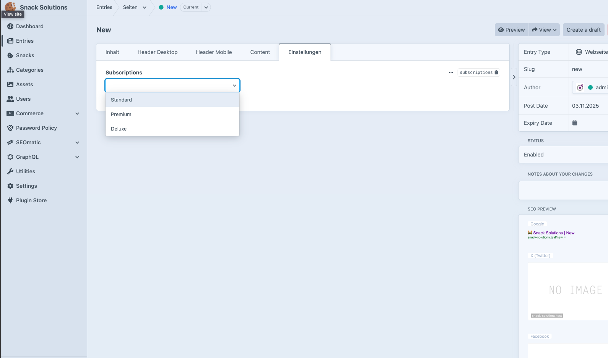

# Subscription Field

Subscription Field is a Craft CMS field type plugin for selecting Craft Commerce subscriptions in your content models.

It provides two field types:
- **Single Subscription Field** – select exactly one Commerce subscription
- **Multiple Subscriptions Field** – select one or more Commerce subscriptions



## Requirements
- PHP 8.2 or higher
- Craft CMS 5.9
- Craft Commerce 5.0 or higher

## Installation

Installing with Composer

```bash
composer require matze/craft-subscription-field
```

Load the Plugin with Craft

```bash
./craft plugin/install subscription-field
```


## License

This Plugin is licensed under the  [MIT](https://choosealicense.com/licenses/mit/) license.


